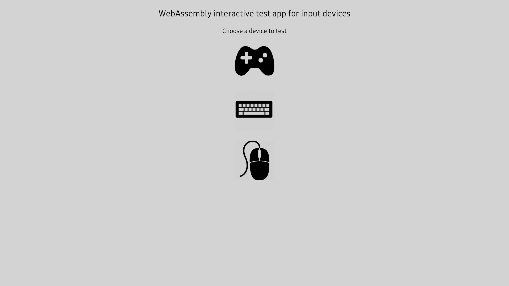
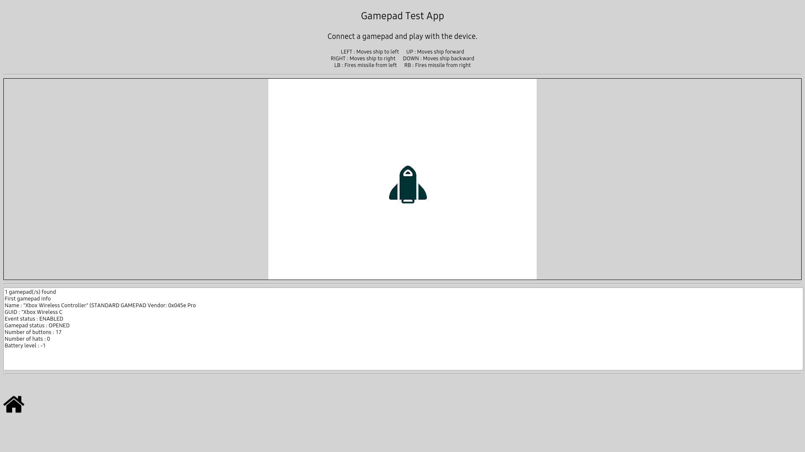
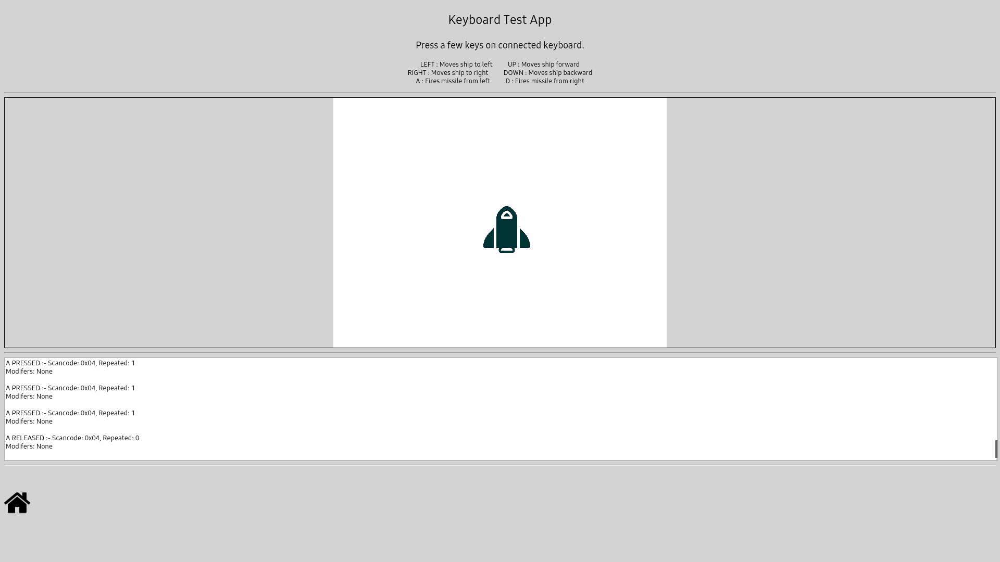
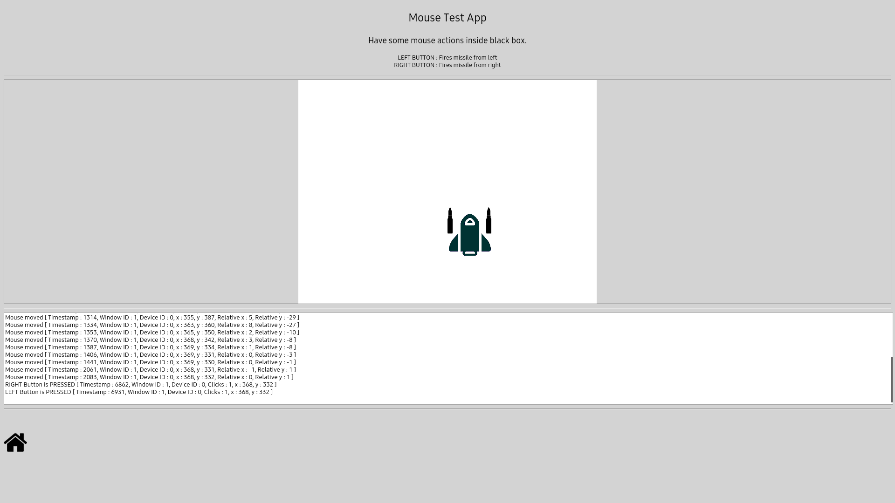

Guide to use this app.

This app could be launched using a web server as it is meant for typical WebAssembly apps

    0 Copy the complete app directory to web server root

    1 Launch the web browser and point to the app served by web server and click on the index.html

If everything went well, you should see as below

Choosing different devices should allow you to see one of the below

Once you are on one of the screen, follow the instruction on the corresponding screen to test the device.

Click the Home button to get back to the main screen.
